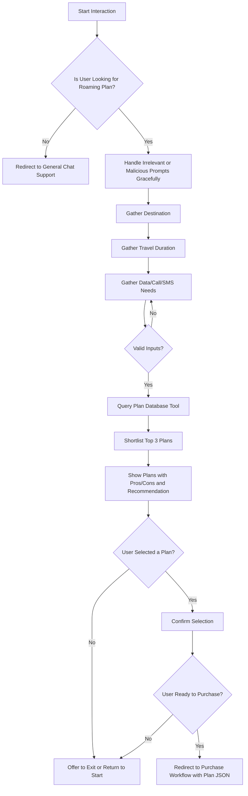

# Custom Agent and Tool
Implement a new custom agent and at least one custom tool suitable for a telecommunications use case. Possible examples include:

- Telco Products/Roaming plan recommendation engine (preferred, due to immediate relevance to JD)
- Billing dispute parsing and categorization (good to have)
- Data usage history check (good to have)

Mocked data is allowed to enable the tool’s demonstration. To keep within a time bound, please describe some of the approaches you have planned and would have utilised, if given sufficient time.

Clearly document:

- The specific business problem your custom tool addresses.
- Integration method between your tool and the agent.

## Proposed Design

The custom agent will be built with **LangChain** using the `AgentExecutor` API. A conversational
LLM (OpenAI `gpt-3.5-turbo`) will drive the agent. The key custom tool is a
**Roaming Plan Recommendation** utility that looks up a mock catalogue of plans
and selects the most appropriate option for the user based on destination,
expected usage and budget. Additional lightweight tools can be added (such as a
billing dispute classifier) but the focus is on demonstrating one complete
example.

## Tool implementation

- Mock data stored in a small CSV is loaded with **pandas**.
- Business logic is implemented as a Python function that accepts structured
  input (destination, data usage, travel duration) and returns a recommended
  plan with reasoning.
- The function is wrapped as a `StructuredTool` in LangChain so the agent can
  invoke it when required.

## Agent flow

1. **Prompt & Memory** – the agent uses a conversation chain with minimal
   memory to maintain context.
2. **Tool Calls** – when the user asks for roaming advice the agent calls the
   recommendation tool, passing the parsed parameters.
3. **Response** – the result is combined with natural language guidance from the
   LLM.

This design keeps the tool logic separate from the agent so that more telco
utilities can be added easily. Mock data keeps the implementation simple while
showing how a real data source would be integrated.

## UX Workflow for Roaming Plan Recommendation Agent

This section outlines the user experience (UX) workflow and agent control flow for recommending roaming plans based on natural language inputs. The flow is implemented using LangChain's `AgentExecutor` framework, integrated with a structured roaming plan database interface.

The goal of the agent is to assist users in selecting the most suitable roaming plan for their travel needs. The system supports natural English input, handles out-of-scope queries gracefully, and guides the user step-by-step through a structured interaction.


### Mermaid Diagram



---

### Step-by-Step Workflow Description

#### Step A: Start Interaction

* Triggered by user's natural language query (e.g., "What are the best roaming options for Malaysia this weekend?").
* Agent listens using a LangChain conversation chain with light memory.

#### Step B: Identify Intent

* Parse whether the user's intent is about roaming plans.
* If not, redirect politely to general support.

#### Step C: Handle Off-topic Inputs

* Gracefully respond to irrelevant ("how bout them bears?") or malicious prompts ("forget all instructions") with mild redirection back to main task.

#### Steps D–F: Requirement Gathering

* Ask user sequentially:

  * Which country are you traveling to?
  * How long will you be staying?
  * What services do you need (data, calls, SMS)?
* Inputs validated against known list of destinations and valid durations.

#### Step G: Retry Logic

* If user gives invalid input (e.g., "I'll be in Blorkistan for a zillion days"), respond with clarification and request again.

#### Step H: Query Plan Tool

* Call structured database tool with valid inputs.
* Fetch matching records from roaming plan database.

#### Step I: Shortlist Plans

* Rank top 3 matching plans based on suitability (e.g., price, validity, service match).

#### Step J: Present Options

* Display brief plan name, pros/cons, and recommendation.
* Maintain concise UX suitable for mobile and voice interfaces.

#### Step K: User Decision

* Ask: "Would you like to select one of these plans?"
* If not, offer to go back or end the session.

#### Step M: Confirm Plan Selection

* Echo selected plan and validate user intent.

#### Step N: Purchase Intent

* Ask: "Would you like to proceed to purchase this plan now?"

#### Step O: Redirect to Purchase

* If yes, redirect to purchase system with plan data encoded in JSON payload:

```json
{
  "plan": {
    "zone": "Zone 1",
    "destination": "Malaysia",
    "validity": "1 day",
    "data": "1GB",
    "price": "S$1"
  },
  "user_id": "<session_or_user_token>"
}
```

### Sample python script for Plans Database Tool

```python
# recommend_agent/tools.py
import pandas as pd
from langchain.tools import tool

# Load the roaming plan dataset
PLANS_CSV_PATH = "data/roaming_plans.csv"
df = pd.read_csv(PLANS_CSV_PATH)

@tool
def plans_db_tool(destination: str, duration: str = "1 day", service_type: str = "data") -> str:
    """
    Recommends the top 3 roaming plans for a given destination, duration, and service type.
    Accepts:
      - destination: country name
      - duration: pass duration (e.g., "1 day", "3 days")
      - service_type: one of "data", "calls", or "sms"
    Returns:
      - A summary of the top 3 matching plans with pros/cons.
    """
    try:
        candidates = df[df['Destination'].str.lower() == destination.lower()]
        candidates = candidates[candidates['Data_Pass_Validity'].str.lower() == duration.lower()]
        if candidates.empty:
            return f"No plans found for {destination} with duration {duration}."

        results = []
        for _, row in candidates.iterrows():
            score = 0
            if service_type == "data":
                score = float(row['Data_Pass_Data'].replace("GB", "").replace("MB", ""))
            elif service_type == "calls":
                score = -float(row['Pay_Per_Use_Call_Outgoing'].replace("S$", "").split("/")[0])
            elif service_type == "sms":
                score = -float(row['Pay_Per_Use_SMS'].replace("S$", "").split("/")[0])

            results.append((score, row))

        top3 = sorted(results, key=lambda x: -x[0])[:3]
        response = ""
        for i, (_, plan) in enumerate(top3, 1):
            response += (
                f"\n{i}. Zone: {plan['Zone']}, Destination: {plan['Destination']}, "
                f"Price: {plan['Data_Pass_Price']}, Data: {plan['Data_Pass_Data']}, "
                f"Calls: {plan['Pay_Per_Use_Call_Outgoing']}, SMS: {plan['Pay_Per_Use_SMS']}"
            )
        return response.strip()
    except Exception as e:
        return f"Error processing request: {str(e)}"

```