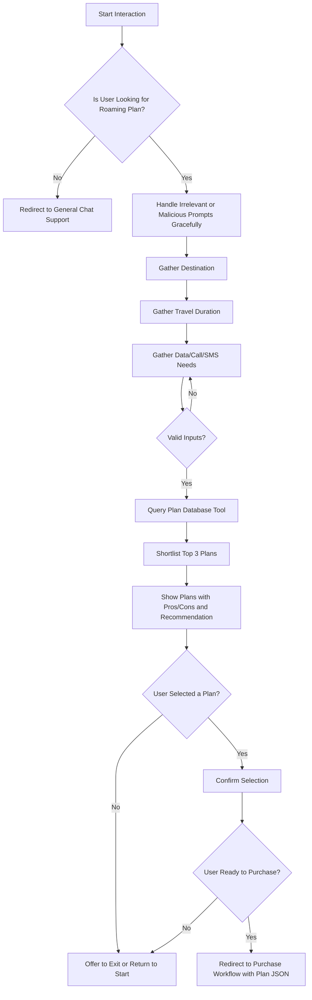

# Custom Agent and Tool
Implement a new custom agent and at least one custom tool suitable for a telecommunications use case. Possible examples include:

- Telco Products/Roaming plan recommendation engine (preferred, due to immediate relevance to JD)
- Billing dispute parsing and categorization (good to have)
- Data usage history check (good to have)

Mocked data is allowed to enable the tool’s demonstration. To keep within a time bound, please describe some of the approaches you have planned and would have utilised, if given sufficient time.

Clearly document:

- The specific business problem your custom tool addresses.
- Integration method between your tool and the agent.

## Proposed Design

The custom agent will be built with **LangChain** using the `AgentExecutor` API. A conversational
LLM (OpenAI `gpt-3.5-turbo`) will drive the agent. The key custom tool is a
**Roaming Plan Recommendation** utility that looks up a mock catalogue of plans
and selects the most appropriate option for the user based on destination,
expected usage and budget. Additional lightweight tools can be added (such as a
billing dispute classifier) but the focus is on demonstrating one complete
example.

## Tool implementation

- Mock data is loaded from CSV files to an **SQLite** database.
- Business logic is implemented as a Python function that accepts structured
  input (destination, data usage, travel duration) and returns a recommended
  plan with reasoning.
- The function is wrapped as a `StructuredTool` in LangChain so the agent can
  invoke it when required.

## Agent flow

1. **Prompt & Memory** – the agent uses a conversation chain with minimal
   memory to maintain context.
2. **Tool Calls** – when the user asks for roaming advice the agent calls the
   recommendation tool, passing the parsed parameters.
3. **Response** – the result is combined with natural language guidance from the
   LLM.

This design keeps the tool logic separate from the agent so that more telco
utilities can be added easily. Mock data keeps the implementation simple while
showing how a real data source would be integrated.

## Language-aware Semantic Interpreter Features

To fulfill the chat agent's role as a **language-aware interpreter** between user inputs and the RoamingPlanRecommender (RPR) tool, the following design features are included:

- **Natural Language Understanding:** The agent uses the LLM to extract and normalize structured fields (e.g., destination, duration, service type, data amount) from freeform text.
- **Progressive Slot Filling:** It tracks missing values and engages in a retry loop until all required fields are gathered.
- **Validation Feedback Loop:** Invalid values (e.g., unknown country or non-numeric duration) are flagged with helpful messages, prompting retry until all inputs are valid for RPR.
- **Structured RPR Call:** Once validated, inputs are passed in structured format to RPR (destination, duration\_days, service\_type, data\_needed\_gb).
- **Results Templating:** Agent formats the RPR shortlist using ranked output and includes pricing, usage limits, and pros/cons.
- **Plan Confirmation Flow:** Agent asks user to confirm preferred plan and whether they want to proceed to purchase.
- **Purchase Redirect Payload:** Upon confirmation, the agent generates a structured JSON payload and initiates redirection to a URL with this plan for purchase.

## UX Workflow for Roaming Plan Recommendation Agent

This section outlines the user experience (UX) workflow and agent control flow for recommending roaming plans based on natural language inputs. The flow is implemented using LangChain's `AgentExecutor` framework, integrated with a structured roaming plan database interface.

The goal of the agent is to assist users in selecting the most suitable roaming plan for their travel needs. The system supports natural English input, handles out-of-scope queries gracefully, and guides the user step-by-step through a structured interaction.


### Mermaid Diagram



---

### Step-by-Step Workflow Description

#### Step A: Start Interaction

* Triggered by user's natural language query (e.g., "What are the best roaming options for Malaysia this weekend?").
* Agent listens using a LangChain conversation chain with light memory.

#### Step B: Identify Intent

* Parse whether the user's intent is about roaming plans.
* If not, redirect politely to general support.

#### Step C: Handle Off-topic Inputs

* Gracefully respond to irrelevant ("how bout them bears?") or malicious prompts ("forget all instructions") with mild redirection back to main task.

#### Steps D–F: Requirement Gathering

* Ask user sequentially:

  * Which country are you traveling to?
  * How long will you be staying?
  * What services do you need (data, calls, SMS)?
* Inputs validated against known list of destinations and valid durations.

#### Step G: Retry Logic

* If user gives invalid input (e.g., "I'll be in Blorkistan for a zillion days"), respond with clarification and request again.

#### Step H: Query Plan Tool

* Call structured database tool with valid inputs.
* Fetch matching records from roaming plan database.

#### Step I: Shortlist Plans

* Rank top 3 matching plans based on suitability (e.g., price, validity, service match).

#### Step J: Present Options

* Display brief plan name, pros/cons, and recommendation.
* Maintain concise UX suitable for mobile and voice interfaces.

#### Step K: User Decision

* Ask: "Would you like to select one of these plans?"
* If not, offer to go back or end the session.

#### Step M: Confirm Plan Selection

* Echo selected plan and validate user intent.

#### Step N: Purchase Intent

* Ask: "Would you like to proceed to purchase this plan now?"

#### Step O: Redirect to Purchase

* If yes, redirect to purchase system with plan data encoded in JSON payload:

```json
{
  "plan": {
    "zone": 1,
    "destination": "Malaysia",
    "duration_days": 1,
    "data_gb": 1,
    "price_sg": 1.0
  },
  "user_id": "<session_or_user_token>"
}
```

This redirect URL or payload is configurable and can integrate with existing purchase portals or mocked endpoints for testing.

### Test cases

__Roaming Plan Tool__

_Basic match on exact plan_

- Test input: Singapore, 1-day trip, 1GB data
- Expected: Plan returned exactly as specified in the DB.

_Interpolated duration match_

- Test input: Malaysia, 2-day trip, 2GB
- Condition: No exact 2-day plan, should interpolate between 1-day and 3-day

_Invalid destination_

- Test input: "Blorkistan", 3-day trip
- Expected: Empty list, error logged about missing zone.

_High data need triggers filtering_

- Test input: Thailand, 7-day trip, 20GB
- Expected: Only plans with ≥ 20GB or fallback score of LARGE_GB
- Assert: Highest data_gb plan selected if no perfect match.

_Unsupported service type_

- Test input: service_type = "fax"
- Expected: No score computed → empty result

__Recommendation Agent__

| Use Case | Best Tool | 
| - | - | 
| Multi-turn conversation	| `agent.step()` or `AgentExecutor.invoke()` with `pytest` |
| Tool call correctness	| Mocking + unittest or `pytest` |
| Output structure validation	| `pytest` + `jsonschema` or custom assert logic |
| State machine step-level testing | Custom agent class with exposed state with `pytest` |

- **Valid query** — "I'm going to Japan for 3 days and need 2GB of data." → Agent returns 3 plan options and confirms.
- **Invalid country** — "I'll be in Blorkistan." → Agent retries with validation feedback.
- **Near match country** — "I'm traveling to Korea." → Agent clarifies with user they are traveling to South Korea, "Korea, Republic of" and selects the appropriate match from available countries.
- **Plan query** — "Need data for Thailand." → Agent prompts for duration and amount.
- **Non-numeric near match duration** — "I'll be there for a few moons." → Agent retries clarifies if user meant months.
- **Non-numeric nonsense duration** — "I'll be there for a few spoons." → Agent retries asking for number of days.
- **Out-of-scope query** — "How's the weather in Tokyo?" → Redirects or politely declines.
- **High data demand** — "Going to Malaysia, need 100GB for 2 weeks." → Agent returns highest available plan and clarifies additional charges apply for excess data.
- **SMS-only request** — "Going to Vietnam, only need SMS for 5 days." → Filters and ranks by SMS cost.
- **Purchase rejection** — User declines to buy after plan is shown → Agent offers to restart or exit.
- **User confirms plan** — Agent assembles JSON payload and returns redirect link.
- **Unexpected user utterance mid-flow** — "Nevermind, show me movie times" → Agent gently resets or offers graceful exit.